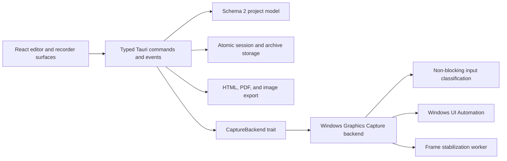

# Architecture

Crumbtrail is split so that product logic and the project format do not depend on Windows handles.

## Frontend

React owns navigation and editor state. All persistent operations cross typed Tauri commands. The main window hosts Home, setup, and the editor. The HUD, region selector, and click-through recording indicator are separate always-on-top webviews protected from capture before they become visible.

The editor does not mutate source screenshots. Markers, outlines, arrows, rectangles, callouts, blur areas, and crops are normalized annotations. Report preview uses the same project settings as export.

## Core and persistence

`ProjectManifest` is the source of truth. Schema `2` is camel-cased at the JavaScript boundary and contains ordered steps with before/after media and application-icon references. Active work is atomically saved under `%LOCALAPPDATA%\Crumbtrail\sessions\<project-id>`.

Portable `.crumbtrail` files are ZIP archives. Extraction is isolated and validates entry count, total uncompressed size, schema version, relative paths, and symlink metadata before a project is admitted to a session.

## Capture pipeline

`CaptureBackend` defines source selection, lifecycle, frames, and classified input without exposing native handles. The Windows implementation uses:

- Windows Graphics Capture for one selected monitor/window and cursor-free RGBA frames.
- `WH_MOUSE_LL` and `WH_KEYBOARD_LL` callbacks that enqueue classified events only.
- A worker that filters target bounds and forms click, text-entry, and manual steps.
- Windows UI Automation for control metadata and physical bounds.
- Local foreground-process icon extraction for project, timeline, and report identity.
- A short in-memory buffer with pre-action and visually stable post-action candidates.
- Redaction before persistence whenever UI Automation identifies a password control.

Ordinary key codes and entered characters are discarded at the hook boundary. The manifest stores only that a text-entry interaction occurred; captured screenshots can still contain text visible on screen.

## Export

HTML is self-contained and accessible, with escaped metadata, inline CSS, and embedded annotated images. Image export shares the same annotation flattener. PDF export launches the installed WebView2/Edge engine in headless print mode against the generated local report HTML. PDF output uses zero physical page margins for full-page theme backgrounds, while each step page owns its internal top and side spacing.

## Platform expansion

A future macOS implementation should implement `CaptureBackend` and keep its native objects internal. The schema, editor, storage, annotations, and exporters are platform-neutral.
